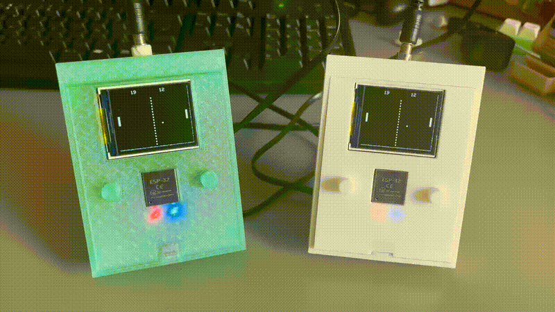
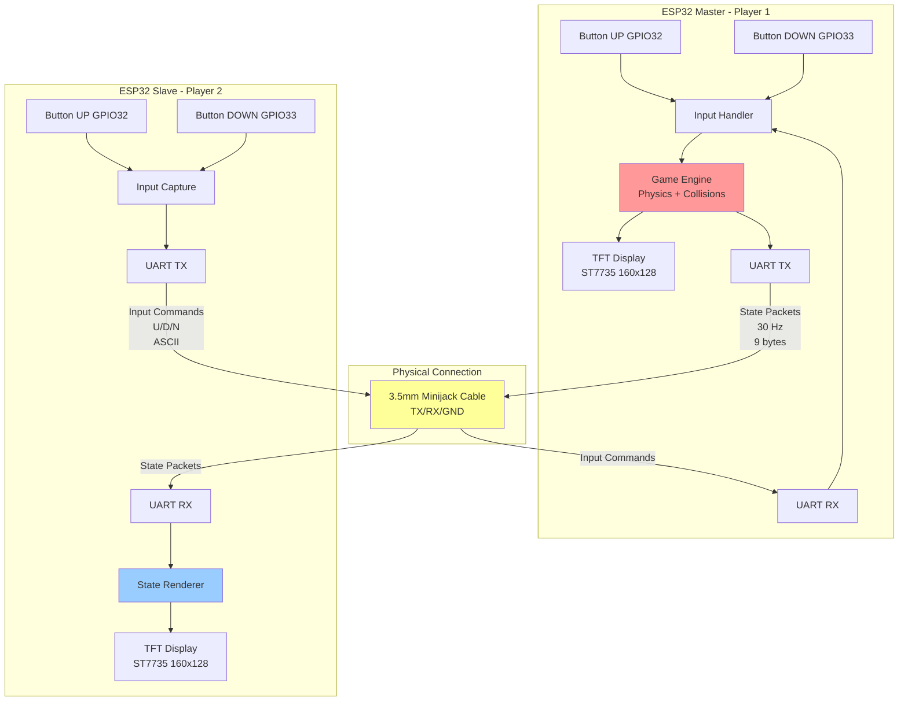

# Distributed Pong Game - ESP32 Multi-Display System

## Abstract

This project implements a distributed real-time Pong game using two ESP32 microcontrollers communicating via UART protocol over a minijack cable connection. The system employs a master-slave architecture where the master ESP32 (Player 1) executes the complete game logic and physics simulation, while the slave ESP32 (Player 2) acts as a remote controller with display capabilities. Both units feature independent ST7735 TFT displays (160×128 px) for autonomous visualization of the game state.

## System Architecture

### Master-Slave Distributed Model

The system implements an asymmetric distributed architecture:



- **Master Node (Player 1)**: Executes the complete game engine, including physics simulation, collision detection, score management, and state synchronization.
- **Slave Node (Player 2)**: Operates as a thin client, handling local input capture and remote state rendering.

This architecture was chosen to:
1. Minimize computational complexity on the slave node
2. Ensure deterministic game behavior (single source of truth)
3. Reduce network traffic by transmitting only essential state data
4. Simplify synchronization mechanisms

### Rationale for Dual Main Architecture

The project contains two separate `main.cpp` implementations because:

1. **Distinct Execution Models**: Each node has fundamentally different responsibilities in the distributed system
2. **Memory Optimization**: Slave node doesn't require game physics code, reducing flash footprint
3. **Independent Development**: Allows isolated testing and debugging of each subsystem
4. **Modularity**: Clear separation of concerns between game controller (master) and input peripheral (slave)

## Technical Specifications

### Hardware Components

| Component | Specification |
|-----------|--------------|
| Microcontroller | ESP32-WROOM-32 (dual-core Xtensa LX6, 240 MHz) |
| Display | ST7735 TFT LCD (160×128 px, 16-bit color depth) |
| Communication Interface | UART (Serial TX/RX) via 3.5mm minijack cable |
| Input Interface | 2× GPIO push-buttons (active-LOW with internal pull-ups) |
| Power Supply | 5V USB (regulated to 3.3V internally) |

### Software Stack

| Layer | Technology |
|-------|------------|
| Platform | PlatformIO + Arduino Framework |
| MCU SDK | ESP-IDF v4.x (abstracted via Arduino) |
| Graphics Library | TFT_eSPI v2.5.43 (hardware SPI acceleration) |
| Language | C/C++ (ISO C++11) |

### Pin Configuration

#### SPI Bus (TFT Display)
```
TFT_MOSI: GPIO 23
TFT_SCLK: GPIO 18
TFT_CS:   GPIO 15
TFT_DC:   GPIO 2
TFT_RST:  GPIO 4
```

#### Control Inputs
```
Player 1 UP:   GPIO 32
Player 1 DOWN: GPIO 33
Player 2 UP:   GPIO 32
Player 2 DOWN: GPIO 33
```

#### UART Communication
```
TX: GPIO 1 (UART0)
RX: GPIO 3 (UART0)
Baud Rate: 115200 bps
```

## Communication Protocol

### UART Binary Protocol

The system uses a custom binary protocol for efficient state transmission:

#### State Packet Structure (`StatePkt`)
```c
struct StatePkt {
  uint8_t a;      // Sync byte 1: 0xAA
  uint8_t b;      // Sync byte 2: 0x55
  uint8_t ballX;  // Ball X position [0-159]
  uint8_t ballY;  // Ball Y position [0-127]
  uint8_t p1Y;    // Player 1 paddle Y position
  uint8_t p2Y;    // Player 2 paddle Y position
  uint8_t sL;     // Left score
  uint8_t sR;     // Right score
  uint8_t cs;     // Checksum (XOR of payload bytes)
};
```

**Packet Size**: 9 bytes  
**Transmission Rate**: ~30 Hz (33 ms interval)  
**Checksum Algorithm**: `cs = ballX ^ ballY ^ p1Y ^ p2Y ^ sL ^ sR`

#### Input Command Protocol (Slave → Master)
```
'U': Move paddle UP
'D': Move paddle DOWN
'N': No action (neutral)
```

**Format**: Single ASCII character followed by newline (`\n`)  
**Timeout**: 300 ms (if no command received, paddle stops)

### Physical Layer

**Connection Type**: 3.5mm TRS (Tip-Ring-Sleeve) minijack cable
- **Tip**: TX (Master) → RX (Slave)
- **Ring**: RX (Master) ← TX (Slave)
- **Sleeve**: Common Ground

## Code Architecture

### Master Node (Player 1)

#### Core Data Structures
```c
typedef struct Ball {
  float size, x, y;
  float speedx, speedy;
} Ball;

typedef struct Paddle {
  float h, w, x, y;
  float speed;
} Paddle;

typedef struct Game {
  int w, h;              // World dimensions
  int scoreL, scoreR;    // Scores
  Ball ball;
  Paddle p1, p2;
} Game;
```

#### Main Loop Flow
```
1. Calculate delta time (dt)
2. Poll local buttons (P1) + UART commands (P2)
3. Update game state (physics + collisions)
4. Render to TFT sprite buffer
5. Push sprite to display
6. Transmit state packet to slave (30 Hz)
```

#### Physics Engine
- **Time step**: Variable dt clamped to 50 ms max
- **Ball velocity**: 120 px/s initial (increases on paddle hits)
- **Collision detection**: AABB (Axis-Aligned Bounding Box)
- **Angle reflection**: Based on paddle impact point (linear interpolation)

### Slave Node (Player 2)

#### Main Loop Flow
```
1. Read local buttons
2. Transmit input command to master
3. Poll UART for state packets
4. Validate packet (sync + checksum)
5. Render received state to TFT display
6. Delay 10 ms
```

#### Synchronization Strategy
- **State-driven rendering**: No local physics simulation
- **Packet validation**: Discards corrupted packets (checksum mismatch)
- **Visual feedback latency**: ~30-60 ms (limited by UART transmission rate)

## Rendering System

### Double-Buffered Sprite Technique

Both nodes use **TFT_eSprite** for flicker-free rendering:

```c
TFT_eSprite spr = TFT_eSprite(&tft);
spr.createSprite(160, 128);  // Allocate 16-bit framebuffer
spr.fillSprite(TFT_BLACK);   // Clear buffer
// ... draw game objects ...
spr.pushSprite(0, 0);         // DMA transfer to display
```

**Advantages**:
- Eliminates screen tearing
- Reduces SPI bus traffic (single bulk transfer)
- Enables complex drawing operations without visible artifacts

### Rendering Pipeline
1. Clear sprite buffer (black background)
2. Draw center dashed line
3. Render score display (fixed position, top-center)
4. Draw paddles (4×20 px rectangles)
5. Draw ball (3×3 px square)
6. Push complete frame to TFT via SPI

## Build & Deployment

### Prerequisites
```bash
# Install PlatformIO Core
pip install platformio

# Clone repository
git clone <repository-url>
cd TFT_display
```

### Compilation

#### Master Node (Player 1)
```bash
pio run -e esp32dev
pio run -e esp32dev --target upload --upload-port COM_X
```

#### Slave Node (Player 2)
Compile using `main_player2.cpp`:
```bash
cd ../
pio run -e esp32dev
pio run -e esp32dev --target upload --upload-port COM_Y
```

### Dependencies

Defined in `platformio.ini`:
```ini
[env:esp32dev]
platform = espressif32
board = esp32dev
framework = arduino
lib_deps = bodmer/TFT_eSPI@^2.5.43
monitor_speed = 115200
```

## Performance Metrics

| Metric | Value |
|--------|-------|
| Frame Rate | ~60 FPS (limited by render time) |
| State Sync Rate | 30 Hz |
| Input Latency | <50 ms (button to paddle movement) |
| Network Latency | ~30 ms (P2 visual update) |
| UART Throughput | ~2.7 kbps (270 bytes/s @ 30 Hz) |
| Memory Usage (Master) | ~45 KB SRAM (sprite buffer + game state) |
| Memory Usage (Slave) | ~42 KB SRAM (sprite buffer only) |

## Future Enhancements

1. **Bidirectional State Sync**: Implement peer-to-peer architecture
2. **Error Correction**: Add CRC16 and packet retransmission
3. **Compression**: Differential encoding of state changes
4. **Input Prediction**: Client-side prediction to reduce perceived latency
5. **Wireless Upgrade**: Migrate to ESP-NOW protocol for cable-free operation

## References

- [ESP32 Technical Reference Manual](https://www.espressif.com/sites/default/files/documentation/esp32_technical_reference_manual_en.pdf)
- [TFT_eSPI Library Documentation](https://github.com/Bodmer/TFT_eSPI)
- [UART Communication Protocol Design](https://en.wikipedia.org/wiki/Universal_asynchronous_receiver-transmitter)

## License

This project is developed for academic purposes as part of Computer Engineering coursework.

---

**Author**: Dario Acuña Soutullo  
**Date**: February 2026  
**Platform**: PlatformIO + ESP32 + Arduino Framework
