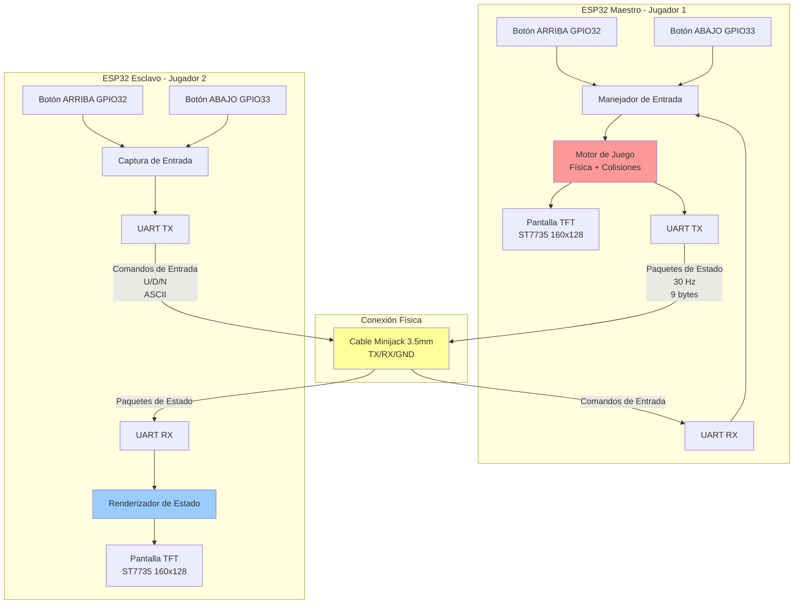

# Juego Pong Distribuido - Sistema Multi-Pantalla ESP32

## Resumen

Este proyecto implementa un juego Pong distribuido en tiempo real utilizando dos microcontroladores ESP32 que se comunican mediante protocolo UART a través de una conexión por cable minijack. El sistema emplea una arquitectura maestro-esclavo donde el ESP32 maestro (Jugador 1) ejecuta la lógica completa del juego y la simulación física, mientras que el ESP32 esclavo (Jugador 2) actúa como controlador remoto con capacidades de visualización. Ambas unidades cuentan con pantallas TFT ST7735 independientes (160×128 px) para visualización autónoma del estado del juego.

## Arquitectura del Sistema

### Modelo Distribuido Maestro-Esclavo

El sistema implementa una arquitectura distribuida asimétrica:



- **Nodo Maestro (Jugador 1)**: Ejecuta el motor de juego completo, incluyendo simulación física, detección de colisiones, gestión de puntuación y sincronización de estados.
- **Nodo Esclavo (Jugador 2)**: Opera como cliente ligero, manejando captura de entrada local y renderizado de estado remoto.

Esta arquitectura fue elegida para:
1. Minimizar la complejidad computacional en el nodo esclavo
2. Garantizar comportamiento determinista del juego (única fuente de verdad)
3. Reducir tráfico de red transmitiendo solo datos de estado esenciales
4. Simplificar mecanismos de sincronización

### Justificación de la Arquitectura Dual-Main

El proyecto contiene dos implementaciones separadas de `main.cpp` porque:

1. **Modelos de Ejecución Distintos**: Cada nodo tiene responsabilidades fundamentalmente diferentes en el sistema distribuido
2. **Optimización de Memoria**: El nodo esclavo no requiere código de física del juego, reduciendo la huella en memoria flash
3. **Desarrollo Independiente**: Permite pruebas y depuración aisladas de cada subsistema
4. **Modularidad**: Clara separación de responsabilidades entre controlador de juego (maestro) y periférico de entrada (esclavo)

## Especificaciones Técnicas

### Componentes Hardware

| Componente | Especificación |
|-----------|--------------|
| Microcontrolador | ESP32-WROOM-32 (dual-core Xtensa LX6, 240 MHz) |
| Pantalla | ST7735 TFT LCD (160×128 px, profundidad de color 16 bits) |
| Interfaz de Comunicación | UART (Serial TX/RX) vía cable minijack 3.5mm |
| Interfaz de Entrada | 2× pulsadores GPIO (activo-LOW con pull-ups internos) |
| Alimentación | 5V USB (regulado a 3.3V internamente) |

### Stack de Software

| Capa | Tecnología |
|-------|------------|
| Plataforma | PlatformIO + Arduino Framework |
| MCU SDK | ESP-IDF v4.x (abstraído vía Arduino) |
| Biblioteca Gráfica | TFT_eSPI v2.5.43 (aceleración SPI por hardware) |
| Lenguaje | C/C++ (ISO C++11) |

### Configuración de Pines

#### Bus SPI (Pantalla TFT)
```
TFT_MOSI: GPIO 23
TFT_SCLK: GPIO 18
TFT_CS:   GPIO 15
TFT_DC:   GPIO 2
TFT_RST:  GPIO 4
```

#### Entradas de Control
```
Jugador 1 ARRIBA: GPIO 32
Jugador 1 ABAJO:  GPIO 33
Jugador 2 ARRIBA: GPIO 32
Jugador 2 ABAJO:  GPIO 33
```

#### Comunicación UART
```
TX: GPIO 1 (UART0)
RX: GPIO 3 (UART0)
Baud Rate: 115200 bps
```

## Protocolo de Comunicación

### Protocolo Binario UART

El sistema utiliza un protocolo binario personalizado para transmisión eficiente de estados:

#### Estructura del Paquete de Estado (`StatePkt`)
```c
struct StatePkt {
  uint8_t a;      // Byte de sincronización 1: 0xAA
  uint8_t b;      // Byte de sincronización 2: 0x55
  uint8_t ballX;  // Posición X de la pelota [0-159]
  uint8_t ballY;  // Posición Y de la pelota [0-127]
  uint8_t p1Y;    // Posición Y de la pala del Jugador 1
  uint8_t p2Y;    // Posición Y de la pala del Jugador 2
  uint8_t sL;     // Puntuación izquierda
  uint8_t sR;     // Puntuación derecha
  uint8_t cs;     // Checksum (XOR de bytes del payload)
};
```

**Tamaño del Paquete**: 9 bytes  
**Tasa de Transmisión**: ~30 Hz (intervalo de 33 ms)  
**Algoritmo de Checksum**: `cs = ballX ^ ballY ^ p1Y ^ p2Y ^ sL ^ sR`

#### Protocolo de Comandos de Entrada (Esclavo → Maestro)
```
'U': Mover pala ARRIBA
'D': Mover pala ABAJO
'N': Sin acción (neutral)
```

**Formato**: Carácter ASCII único seguido de salto de línea (`\n`)  
**Timeout**: 300 ms (si no se recibe comando, la pala se detiene)

### Capa Física

**Tipo de Conexión**: Cable minijack TRS (Tip-Ring-Sleeve) 3.5mm
- **Punta (Tip)**: TX (Maestro) → RX (Esclavo)
- **Anillo (Ring)**: RX (Maestro) ← TX (Esclavo)
- **Manguito (Sleeve)**: Tierra común

## Arquitectura del Código

### Nodo Maestro (Jugador 1)

#### Estructuras de Datos Core
```c
typedef struct Ball {
  float size, x, y;
  float speedx, speedy;
} Ball;

typedef struct Paddle {
  float h, w, x, y;
  float speed;
} Paddle;

typedef struct Game {
  int w, h;              // Dimensiones del mundo
  int scoreL, scoreR;    // Puntuaciones
  Ball ball;
  Paddle p1, p2;
} Game;
```

#### Flujo del Bucle Principal
```
1. Calcular delta time (dt)
2. Sondear botones locales (J1) + comandos UART (J2)
3. Actualizar estado del juego (física + colisiones)
4. Renderizar en buffer de sprite TFT
5. Enviar sprite a pantalla
6. Transmitir paquete de estado al esclavo (30 Hz)
```

#### Motor Físico
- **Paso temporal**: dt variable limitado a 50 ms máximo
- **Velocidad de pelota**: 120 px/s inicial (aumenta en impactos con palas)
- **Detección de colisiones**: AABB (Axis-Aligned Bounding Box)
- **Reflexión angular**: Basada en punto de impacto de la pala (interpolación lineal)

### Nodo Esclavo (Jugador 2)

#### Flujo del Bucle Principal
```
1. Leer botones locales
2. Transmitir comando de entrada al maestro
3. Sondear UART para paquetes de estado
4. Validar paquete (sincronización + checksum)
5. Renderizar estado recibido en pantalla TFT
6. Delay 10 ms
```

#### Estrategia de Sincronización
- **Renderizado dirigido por estado**: Sin simulación física local
- **Validación de paquetes**: Descarta paquetes corruptos (checksum no coincidente)
- **Latencia de retroalimentación visual**: ~30-60 ms (limitada por tasa de transmisión UART)

## Sistema de Renderizado

### Técnica de Sprite con Doble Buffer

Ambos nodos usan **TFT_eSprite** para renderizado sin parpadeo:

```c
TFT_eSprite spr = TFT_eSprite(&tft);
spr.createSprite(160, 128);  // Asignar framebuffer de 16 bits
spr.fillSprite(TFT_BLACK);   // Limpiar buffer
// ... dibujar objetos del juego ...
spr.pushSprite(0, 0);         // Transferencia DMA a pantalla
```

**Ventajas**:
- Elimina el tearing de pantalla
- Reduce tráfico en bus SPI (única transferencia en bloque)
- Permite operaciones de dibujo complejas sin artefactos visuales

### Pipeline de Renderizado
1. Limpiar buffer de sprite (fondo negro)
2. Dibujar línea central discontinua
3. Renderizar marcador (posición fija, superior-centro)
4. Dibujar palas (rectángulos 4×20 px)
5. Dibujar pelota (cuadrado 3×3 px)
6. Enviar frame completo a TFT vía SPI

## Compilación y Despliegue

### Requisitos Previos
```bash
# Instalar PlatformIO Core
pip install platformio

# Clonar repositorio
git clone <url-repositorio>
cd TFT_display
```

### Compilación

#### Nodo Maestro (Jugador 1)
```bash
pio run -e esp32dev
pio run -e esp32dev --target upload --upload-port COM_X
```

#### Nodo Esclavo (Jugador 2)
Compilar usando `src/main.cpp` del directorio `pong_p2/`:
```bash
cd ../pong_p2
pio run -e esp32dev
pio run -e esp32dev --target upload --upload-port COM_Y
```

### Dependencias

Definidas en `platformio.ini`:
```ini
[env:esp32dev]
platform = espressif32
board = esp32dev
framework = arduino
lib_deps = bodmer/TFT_eSPI@^2.5.43
monitor_speed = 115200
```

## Métricas de Rendimiento

| Métrica | Valor |
|--------|-------|
| Tasa de Frames | ~60 FPS (limitado por tiempo de renderizado) |
| Tasa de Sincronización | 30 Hz |
| Latencia de Entrada | <50 ms (botón a movimiento de pala) |
| Latencia de Red | ~30 ms (actualización visual J2) |
| Throughput UART | ~2.7 kbps (270 bytes/s @ 30 Hz) |
| Uso de Memoria (Maestro) | ~45 KB SRAM (buffer sprite + estado juego) |
| Uso de Memoria (Esclavo) | ~42 KB SRAM (buffer sprite únicamente) |

## Mejoras Futuras

1. **Sincronización Bidireccional**: Implementar arquitectura peer-to-peer
2. **Corrección de Errores**: Añadir CRC16 y retransmisión de paquetes
3. **Compresión**: Codificación diferencial de cambios de estado
4. **Predicción de Entrada**: Predicción del lado cliente para reducir latencia percibida
5. **Actualización Inalámbrica**: Migrar a protocolo ESP-NOW para operación sin cables

## Referencias

- [Manual de Referencia Técnica ESP32](https://www.espressif.com/sites/default/files/documentation/esp32_technical_reference_manual_en.pdf)
- [Documentación Biblioteca TFT_eSPI](https://github.com/Bodmer/TFT_eSPI)
- [Diseño de Protocolo de Comunicación UART](https://en.wikipedia.org/wiki/Universal_asynchronous_receiver-transmitter)

## Licencia

Este proyecto ha sido desarrollado con fines académicos como parte del trabajo de Ingeniería Informática.

---

**Autor**: Dario Acuña Soutullo
**Fecha**: Febrero 2026  
**Plataforma**: PlatformIO + ESP32 + Arduino Framework
